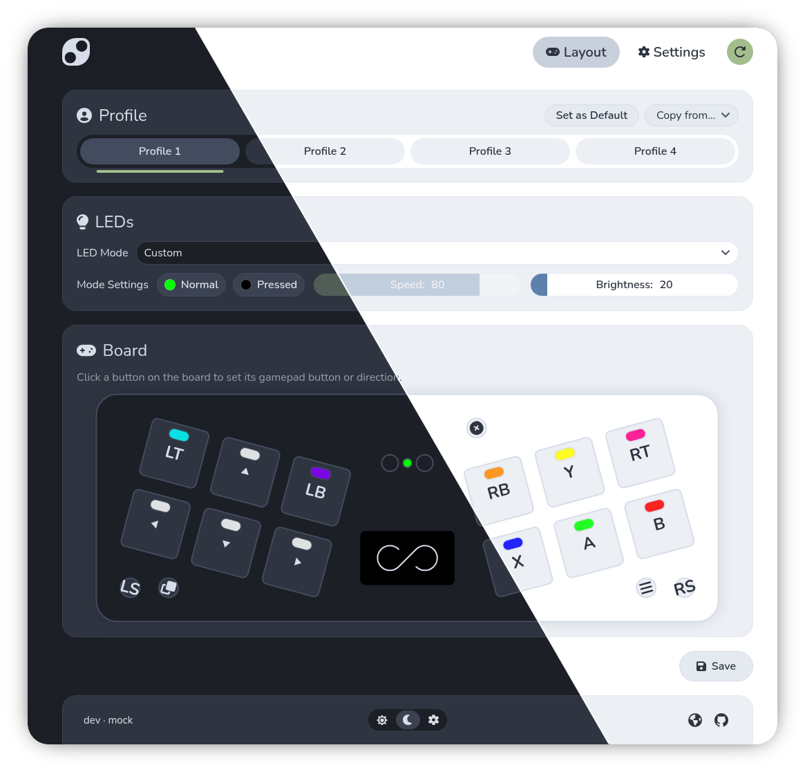

<p align="center">
  <picture>
    <source media="(prefers-color-scheme: dark)" srcset="assets/mp2040-logo.svg">
    <source media="(prefers-color-scheme: light)" srcset="assets/mp2040-logo-light.svg">
    
  </picture>
</p>

<p align="center">
	<a href="https://github.com/thnikk/GP2040-th">
		
	</a>
</p>



Firmware for RP2040-based keypads. This is a replacement for the old
[Unified 2022](https://github.com/thnikk/unified-2022) firmware, utilizing
the advantages of [GP2040-th](https://github.com/thnikk/GP2040-th) like
the RNDIS web server and removing unnecessary features.
The intention is to have a more stripped down and stable base
to work with and focus on usability over runtime board configuration.

## Supported Boards

All boards require an RP2040 microcontroller. Existing boards using the SAMD21 are __NOT__ compatible.

### Mechanical Keypads
<table>
<tr>
<td> 2k </td> <td> 2kw </td> <td> 4kw </td> <td> 3x3 </td> <td> MacroPad </td>
</tr>
</table>

### Touch Keypads

<table>
<tr>
<td> MiniTouch </td> <td> MegaTouch </td> <td> 4kMegaTouch </td> <td> BeatBoard </td>
</tr>
</table>

### Controllers

<table>
<tr>
<td> Fightboard </td> <td> Fightboard-m </td> <td> Fightboard-b </td> <td> Fightboard-b-m </td> <td> Springboard </td>
</tr>
</table>

## Flashing

Download the latest `.uf2` for your board from the
[releases page](https://github.com/thnikk/MP2040/releases).

To flash:

1. Hold the **BOOTSEL** button on the keypad (or double-tap reset) and plug it in.
2. The keypad appears as a USB drive named `RPI-RP2`.
3. Drag the `.uf2` file onto the drive. The keypad reboots with the new firmware.

## Web Config

Hold the first key while powering on to open the web config; hold the second
key to enter the bootloader. The device appears as a network adapter and
serves the configurator at `http://192.168.7.1`, where you can remap keys, set
up macros, and adjust LED colors.

## Input Modes

MP2040 currently supports the following input modes:

- **Keyboard**: Full NKRO HID report (default)
- **MIDI**: Send MIDI notes on a configured channel with global and per-key velocities
- **XInput**: Presents as an Xbox 360 controller (PC)
- **XBOne**: Presents as an Xbox One controller (PC, supports USB CDC and capture button)
- **Switch Pro**: Emulates a Pro Controller (Nintendo hardware)

## Key Scanning

How the board reads the keys:

- **Direct GPIO**: Each key is wired directly to a GPIO pin
- **Matrix**: Keys are wired to grids of rows and columns
- **Capacitive Touch**: Each key is a capacitive touch pad
- **Touch Ring**: 4 pad touch ring

## Development

Build the firmware:

```sh
python3 docker-build.py -b 2k
```

Output: `build/MP2040_<version>_<sha>_<Board>.uf2`. `docker-build.py` flags:
`-b <Board>`, `-c` clean, `-v` verbose, `-f` flash to board, `-n` nuke first,
`-p <path>` flash mount, `-w` auto-boot to web config after flashing.

Run the web config mock server:

```sh
./web-config.py
```

`web-config.py` runs `npm install` if needed, then serves the configurator at
`http://localhost:3000`. Flags: `-b <Board>`, `-u <version>` (fake update),
`-p <port>`, `--dev-board` (proxy to a real board).
